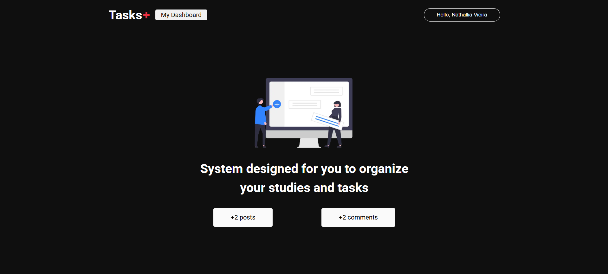
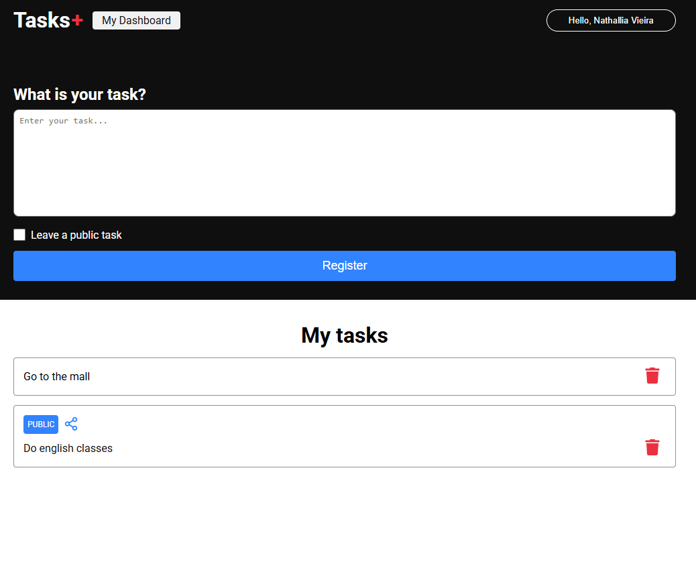
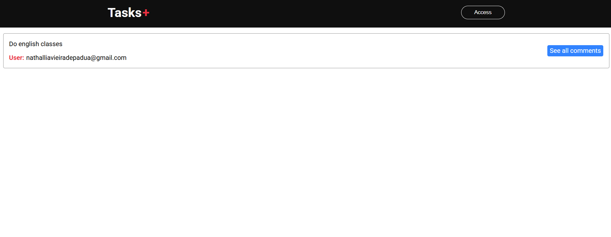
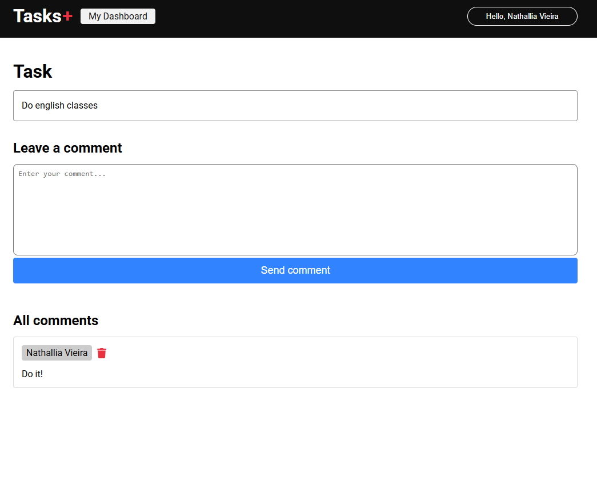

# Tasks+

> A task management app where users can create public or private tasks, share them and leave comments.

---

## 📸 Screenshots

| Home | Dashboard — My Tasks |
|------|----------------------|
|  |  |

| All Tasks (Public) | Task Details & Comments |
|--------------------|------------------------|
|  |  |

---

## ✨ Features

- 🔐 Authentication — login with Google via NextAuth
- ✅ Task creation — add tasks and choose whether they are public or private
- 🌐 Public tasks — publicly listed tasks are visible to all users with a shareable link
- 💬 Comments — authenticated users can leave comments on any public task
- 🗑️ Delete — users can delete their own tasks and comments
- 📊 Dashboard — personal view showing all your tasks with post and comment counts

---

## 🛠️ Tech Stack


---

## 🚀 Getting Started

### Prerequisites

- Node.js 18+
- A Firebase project or compatible database

### Installation

```bash
# Clone the repository
git clone https://github.com/nathalliavieira/tasksplus.git
cd tasksplus

# Install dependencies
npm install

# Set up environment variables
cp copy.env .env.local
# Edit .env.local with your credentials
```

### Environment Variables

```env
NEXTAUTH_URL=http://localhost:3000
NEXTAUTH_SECRET=your_nextauth_secret
GOOGLE_CLIENT_ID=your_google_client_id
GOOGLE_CLIENT_SECRET=your_google_client_secret
```

### Running locally

```bash
npm run dev
```

Open [http://localhost:3000](http://localhost:3000) in your browser.

---

## 🌐 Live Demo

👉 [tasksplus-omega.vercel.app](https://tasksplus-omega.vercel.app)
